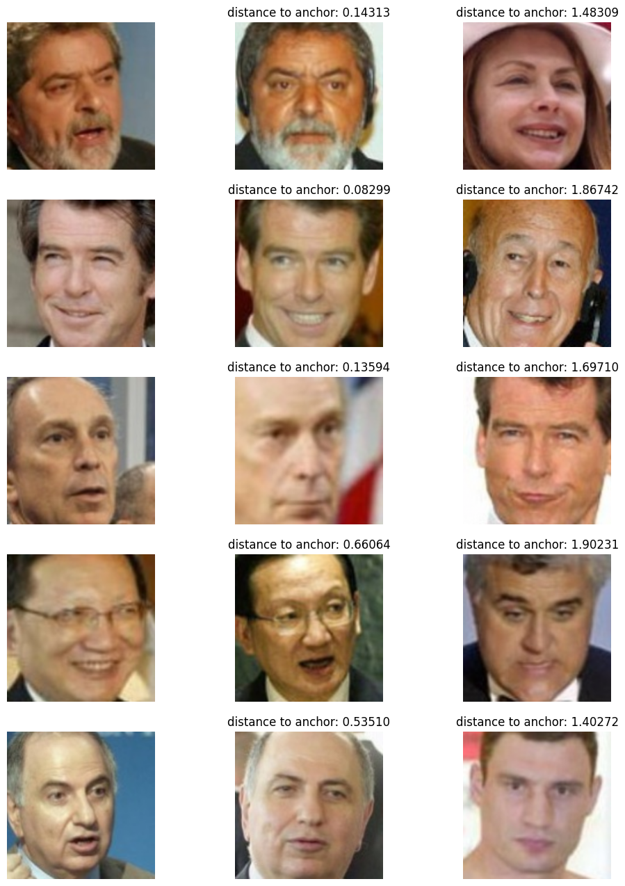

# lfw_recognition

## Face Recognition [Dataset](https://www.kaggle.com/datasets/stoicstatic/face-recognition-dataset)

This dataset has been derived from the Labeled Faces in the Wild Dataset.
This dataset is a collection of JPEG pictures of famous people collected on the internet.

* Each picture is centered on a single face, and every image is encoded in RGB. The original images are of the size 250 x 250
* The dataset contains 1680 directories, each representing a celebrity
* Each directory has 2-50 images for the celebrity

___

## Model

* Extracting features from images with ResNet50
* 2 fully connected layers with batch normalization
* Output embedding layer with dim 256 and L2 normalization
* Triplet loss

___

## Inference

```text
Accuracy: train 0.9543 | test: 0.8902
```

Example measurement of distances between triplet-loss embeddings

